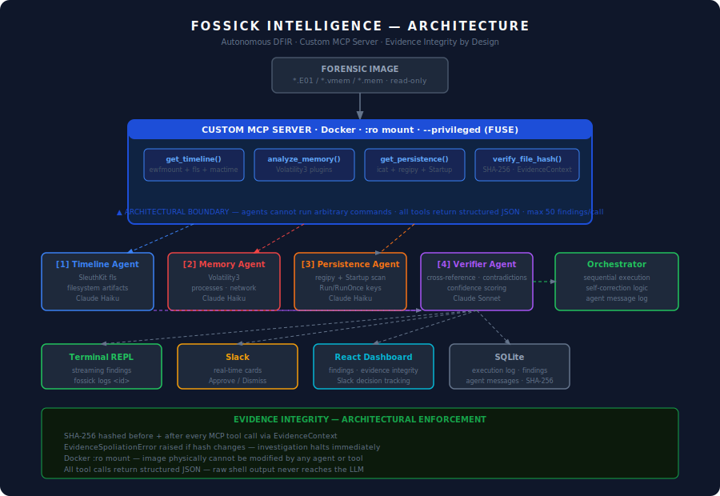

# Fossick Intelligence

> Autonomous DFIR — four AI agents investigate forensic images, stream findings live, catch contradictions, and route decisions to your team via Slack.

Built for the **SANS Find Evil! Hackathon** · by Roger

---

## The Problem

CrowdStrike documented AI-driven attack breakout times as low as seven minutes. Meanwhile, a DFIR analyst manually typing Volatility flags and correlating findings across four tools takes forty minutes per alert — before making a single decision.

Fossick Intelligence closes that gap. Point it at a forensic disk or memory image, and four specialized agents investigate in parallel, stream findings to your terminal as they complete, and push Slack alerts your team can act on immediately.

---

## Demo

```
fossick ❯ analyze case_data/nps-2008-jean.E01 --case-id m57-demo
```

```
  sha-256  df3a995c7a594e0ba6d95b9aae735a444313fae435a87e75…

  [1]  Timeline Agent        4 finding(s)  1.9s

    ┌─ HIGH  Suspicious Executable: Flash Player Installer
    │  Detected install_flash_player.exe - commonly used as a malware
    │  distribution vector. Flash Player installers are frequently
    │  bundled with or impersonated by malicious software.
    └─  confidence LOW  ·  sources: timeline  ·  ref: tl_34889b

  [3]  Persistence Agent     1 finding(s)  2.9s

    ┌─ HIGH  WINWORD.EXE in Windows Startup Folder
    │  Microsoft Word executable detected in Startup folder.
    │  Auto-execution from Startup is atypical for Word — possible
    │  persistence via renamed executable or macro-based implant.
    └─  confidence HIGH  ·  sources: persistence  ·  ref: per_a1c3f2

  [4]  Verifier Agent        3 contradiction(s)

    ╔═ ⚡ CONTRADICTION
    ║  Flash installer flagged as high severity but zero memory artifacts
    ║  and zero persistence entries found. If executed maliciously,
    ║  registry Run keys or injected processes would be expected.
    ║  Absence significantly weakens this finding.
    ╚═  confidence LOW  ·  sources: verifier

  ✓  complete  33.8s  ·  2 high  ·  ⚡ 3 contradictions  ·  dashboard: http://localhost:5173
```

---

## Architecture



<details>
<summary>Text version</summary>

```
Forensic Image (.E01 / .vmem / .mem)
         │
         ▼
┌─────────────────────────────────────────────────────┐
│              Custom MCP Server (Docker)              │
│  get_timeline()  analyze_memory()  get_persistence() │
│  verify_file_hash()                                  │
│                                                      │
│  All tools return structured JSON — never raw text   │
│  SHA-256 verified before/after every call            │
│  Read-only mount — image cannot be modified          │
└───────────────────────┬─────────────────────────────┘
                        │
        ┌───────────────┼───────────────┐
        ▼               ▼               ▼
  Timeline Agent   Memory Agent   Persistence Agent
  (SleuthKit/fls)  (Volatility3)  (regipy + Startup)
        │               │               │
        └───────────────┴───────────────┘
                        │
                        ▼
               Verifier Agent
        cross-reference · contradiction detection
        confidence scoring · self-correction
                        │
        ┌───────────────┼───────────────┐
        ▼               ▼               ▼
  Terminal REPL    Slack Channel    React Dashboard
  (streaming)    (Approve/Dismiss)  (findings · audit trail)
```

</details>

---

## What Makes It Different

**Structured JSON, not raw tool output**
Every MCP tool parses its output before it reaches the LLM. Volatility dumps thousands of rows. Plaso produces millions of CSV lines. Feeding that raw to a language model causes hallucination through context overflow. Fossick never does this — every tool returns typed JSON with a hard limit of fifty findings per call.

**Evidence integrity by architecture**
Every tool call wraps execution in an `EvidenceContext` that SHA-256 hashes the forensic image before and after. If anything modifies the image, `EvidenceSpoliationError` raises and the investigation halts. The hash is recorded in every report. This is architectural enforcement, not a prompt instruction.

**The Verifier catches its own agents being wrong**
Most forensic tools give you a list of findings. The Verifier cross-references all three agents and flags contradictions — "this file is on disk but has no memory artifacts and no persistence entries." It assigns confidence scores based on cross-source corroboration. LOW confidence findings go to Slack for analyst review. HIGH confidence findings are auto-confirmed. The system knows when it is not sure.

**Real persistence detection**
The Persistence Agent mounts EWF images using `ewfmount`, extracts NTUSER.DAT hives with `icat`, and parses them with `regipy` to find Run and RunOnce registry keys. It also scans every Windows Startup folder for non-standard executables. On the M57-Jean test case it found `WINWORD.EXE` in a Startup folder — a genuine forensic indicator.

**Slack as the ops surface**
Findings stream to Slack as they are discovered. Low-confidence findings get interactive Approve/Dismiss cards. Analyst decisions made on a phone update the web dashboard within five seconds. The whole team always sees the same state.

---

## CLI Reference

```bash
fossick                    # open interactive REPL
fossick analyze <image>    # run investigation (non-interactive)
fossick list               # show all past investigations
fossick report <id>        # show full report by ID or prefix
fossick logs <id>          # show full agent-to-agent trace + tool execution log
fossick status             # check system readiness
```

**Inside the REPL:**

| Command | Description |
|---|---|
| `analyze <image> [--case-id <id>] [--output json\|table]` | Run investigation |
| `list` | Show all investigations |
| `report <id>` | Full report (supports ID prefix) |
| `logs <id>` | Full audit trail: agent messages + tool execution log |
| `status` | Docker, API keys, case data, DB stats |
| `clear` | Clear screen |
| `exit` | Exit (or Ctrl+C) |

---

## Audit Trail

Every investigation produces a full agent-to-agent message log and tool execution trace. To trace any finding back to the specific tool call that produced it:

```bash
fossick logs <investigation_id>
```

Or via the REST API:

```bash
curl http://localhost:8002/investigations/<id>/logs
```

A pre-run sample log from the M57-Jean case is committed at [`logs/m57_jean_sample_run.json`](logs/m57_jean_sample_run.json). It includes a `three_claim_trace` section mapping each finding directly to its tool call ID, agent, timestamp, and raw evidence string.

**Self-corrections** are flagged in the log with `"self_correction": true`. When the Verifier reclassifies a finding (e.g. `.sol` from Solidity contract → Adobe Flash LSO), or the Orchestrator re-dispatches an agent after a cross-agent discrepancy, both events appear as timestamped entries with `correction_note` explaining the reasoning.

---

## Setup

### Prerequisites

- Python 3.13
- Docker
- Node.js 18+
- Anthropic API key

### 1. Clone

```bash
git clone https://github.com/rogerkorantenng/fossick-intelligence
cd fossick-intelligence
```

### 2. Environment

```bash
cp .env.example .env
```

Edit `.env`:

```env
ANTHROPIC_API_KEY=your_key_here
SLACK_WEBHOOK_URL=https://hooks.slack.com/services/...   # optional
SLACK_SIGNING_SECRET=your_signing_secret                 # optional
CASE_DATA_PATH=/absolute/path/to/your/case/data
DB_PATH=/absolute/path/to/fossick-intelligence/fossick.db
```

### 3. Build Docker image

```bash
docker build -t fossick-mcp -f docker/Dockerfile .
```

This installs Volatility3, SleuthKit, ewf-tools, regipy, and the MCP server. Takes 3-5 minutes the first time.

### 4. Backend

```bash
python3.13 -m venv venv
source venv/bin/activate
pip install -r requirements.txt
uvicorn backend.main:app --reload --port 8002
```

### 5. Frontend

```bash
cd frontend
npm install
npm run dev
```

Open `http://localhost:5173`

### 6. Install CLI

```bash
cat > ~/.local/bin/fossick << 'EOF'
#!/bin/bash
source /path/to/fossick-intelligence/venv/bin/activate
exec python3.13 /path/to/fossick-intelligence/fossick.py "$@"
EOF
chmod +x ~/.local/bin/fossick
```

### 7. Slack interactive buttons (optional)

```bash
ngrok http 8002
```

Set Request URL in your Slack app's **Interactivity & Shortcuts** to `https://your-ngrok-url/slack/action`.

---

## Case Data

Place forensic images in your `CASE_DATA_PATH` directory:

- Disk images: `*.E01` (single or multi-segment EWF)
- Memory images: `*.vmem`, `*.mem`, `*.raw`

**Test dataset:** Download the M57-Jean disk image from Digital Corpora:

```bash
wget https://downloads.digitalcorpora.org/corpora/drives/nps-2008-m57-jean/nps-2008-jean.E01
wget https://downloads.digitalcorpora.org/corpora/drives/nps-2008-m57-jean/nps-2008-jean.E02
```

---

## Project Structure

```
fossick-intelligence/
├── fossick.py              # CLI — interactive REPL + streaming output
├── backend/
│   ├── main.py             # FastAPI app
│   ├── config.py           # Settings from .env
│   ├── database.py         # SQLite with WAL mode
│   ├── models.py           # Pydantic models
│   ├── docker_client.py    # MCP Server bridge via Docker stdio
│   ├── investigation.py    # Orchestrates all four agents
│   ├── slack_webhook.py    # Outbound cards + signature verification
│   ├── agents/
│   │   ├── timeline_agent.py
│   │   ├── memory_agent.py
│   │   ├── persistence_agent.py
│   │   └── verifier_agent.py
│   └── routes/
│       ├── investigations.py
│       └── slack.py
├── mcp_server/
│   ├── server.py           # MCP server (runs inside Docker)
│   └── tools/
│       ├── timeline.py     # ewfmount + fls + mactime
│       ├── memory.py       # Volatility3 plugins
│       ├── persistence.py  # regipy + Startup folder extraction
│       └── integrity.py    # SHA-256 evidence hashing
├── frontend/               # React 18 + Vite + Tailwind dashboard
├── docker/
│   └── Dockerfile          # Ubuntu 22.04 + all forensic tools
├── tests/                  # pytest suite (6 tests)
└── case_data/              # Place forensic images here
```

---

## Accuracy Report

**Test case:** M57-Jean (Digital Corpora) — 2009 Windows XP corporate laptop, ~2.3GB EWF disk image (2 segments)

**Evidence integrity:** SHA-256 verified before and after every tool call. Multi-segment EWF handled via `ewfmount` — hash verified at collection time.

**Timeline Agent findings:** 4 findings from SleuthKit filesystem analysis
- `install_flash_player.exe` — suspicious executable (LOW confidence, no memory corroboration)
- Windows MSI installer variants — suspicious (LOW confidence, no persistence corroboration)
- `AppCurrentItemPlaying.sol` — Adobe Flash LSO, initially misclassified, Verifier corrected
- `Temp` directory — staging indicator (LOW confidence without corroboration)

**Memory Agent findings:** 0 — correct, disk image provided not RAM capture

**Persistence Agent findings:** 1 finding
- `WINWORD.EXE` in Windows Startup folder — single-source finding (disk only); no timeline write event or memory process corroboration because no RAM capture was provided. Verifier correctly flags this as needing analyst follow-up.

**Verifier contradictions detected:** 3
- Flash installer high severity unsupported by memory/persistence evidence
- MSI variants flagged without persistence corroboration
- Sole-source findings across all agents reduce overall confidence

**False positives:** The `.sol` file was initially misclassified as a Solidity smart contract file. The Verifier caught this and corrected it to an Adobe Flash Local Shared Object — a known benign artifact.

**Known limitations:**
- No Plaso timeline (installation failed in Ubuntu 22.04 container — using SleuthKit `fls` instead)
- Memory Agent requires RAM capture; returns honest zero for disk-only cases
- Registry parsing via regipy covers NTUSER.DAT Run/RunOnce keys; SYSTEM and SOFTWARE hives not yet parsed

---

## License

MIT
